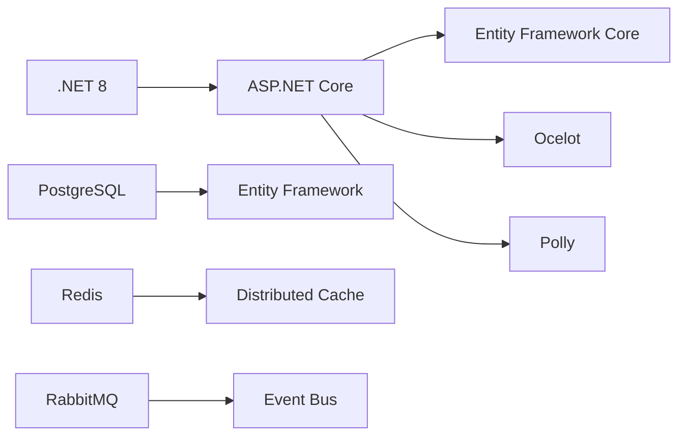
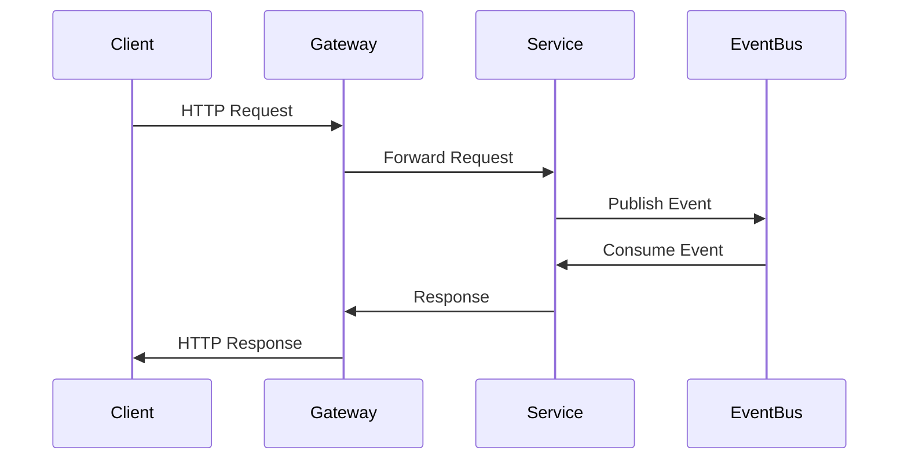
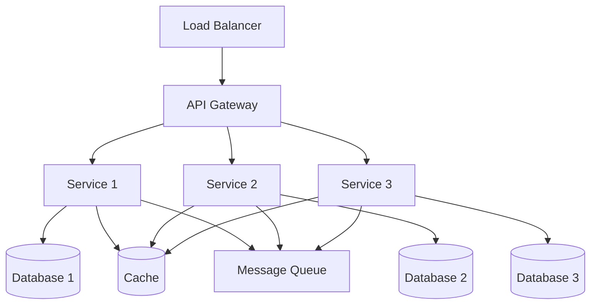

# E-Commerce Microservices Architecture

## Overview

This project implements a modern e-commerce platform using a microservices architecture. The system is designed to be scalable, resilient, and maintainable, following domain-driven design principles and event-driven communication patterns.

## Architecture

## Service Components

### API Gateways

1. **Ocelot API Gateway**
   - Routes external requests to appropriate microservices
   - Implements API composition and request aggregation
   - Handles cross-cutting concerns like authentication and rate limiting

2. **Aggregator Gateway**
   - Provides composite APIs for complex operations
   - Orchestrates multiple service calls
   - Implements circuit breaker pattern for resilience

### Core Services

1. **Basket Service**
   - Manages shopping cart operations
   - Implements distributed caching with Redis
   - Handles concurrent cart modifications

2. **Product Service**
   - Manages product catalog and inventory
   - Implements product search and filtering
   - Publishes product-related events

3. **Order Service**
   - Processes order creation and management
   - Implements saga pattern for distributed transactions
   - Maintains order history and status

4. **Payment Service**
   - Handles payment processing
   - Implements payment gateway integration
   - Manages transaction history

## Technology Stack

### Infrastructure

- **PostgreSQL**: Primary data store for services
- **Redis**: Distributed caching for basket service
- **RabbitMQ**: Message broker for event-driven communication
- **Docker**: Containerization and orchestration
- **Docker Compose**: Local development environment

## Communication Patterns

### Key Patterns

1. **Event-Driven Architecture**
   - Asynchronous communication between services
   - Loose coupling and high scalability
   - Eventual consistency

2. **Circuit Breaker**
   - Fault tolerance and resilience
   - Graceful degradation
   - Automatic recovery

3. **CQRS Pattern**
   - Separate read and write models
   - Optimized query performance
   - Scalable data access

## Development Guidelines

1. **Service Independence**
   - Each service has its own database
   - Independent deployment and scaling
   - Service-specific technology choices

2. **API Design**
   - RESTful endpoints
   - Versioned APIs
   - Standardized error handling

3. **Testing Strategy**
   - Unit tests for business logic
   - Integration tests for service communication
   - End-to-end tests for critical flows

## Deployment Architecture

## Monitoring and Observability

- Distributed tracing
- Centralized logging
- Health checks
- Performance metrics
- Alerting system 
